# median-image-filtering
CSC382 Analysis of Algorithms Final Project
---
## To run this code, download the .cpp files and extract the images from the images folder into the working directory. Everything is automated via console input.
---
**Part I: Implement the order statistic algorithm.**

Generate n random numbers in the range of [1..N], which are unordered. 
Implement the order statistic algorithm we studied in the class and run the order statistic experiment to find the ith smallest number. Note that you can vary the population size N and the sample size n where N=5000, 8000, 10000 and n= 100, 300, 500, 1000, 2000, 4000. Pick i as the random number in 1..n five times.

Note: 
- You may have to repeat the algorithm many times, each time you need to initialize the array. 
- Your running time should exclude the time for initialization.  (3) All measurement should be done in a single run, i.e. you do not need to run once for n=100, another time for n=200, etc

What to turn in:
- Well documented source code in C++
-	Report the CPU running time in a table for all combinations of n, N and order i; report average CPU running time on order i in a table for all combinations of n and N.
- Plot the running time of the algorithm results for all combination of n and N.

**Part II. Apply your algorithm to median filtering of an image** 

Apply your algorithm to median filtering of an image, which is a technique for smoothing a "noisy" image. For each pixel of an image, the filtering procedure considers an (n x n) window centered on that pixel, computes the median of gray-level values in the window, and replaces the original pixel with the median value. The median is defined as the middle value in a sorted sequence. For example, consider the following (3 x 3) window of pixels:
 11	 90	 74
 71	 14	 92
 20	 87	 68
The sorted sequence of these pixels is <11, 14, 20, 68, 71, 74, 87, 90, 92>, and the middle of the sequence is 71, which is the median of the window; thus, the filtering procedure will replace the center pixel with 71.
The result of replacing all pixels with median values is a smoothed image, with almost no background noise, which improves the effectiveness of image-recognition algorithms. On the negative side, the new image is blurrier than the original, that is, it looks like an unfocussed monitor.
Note:
- The window size, N, is one input. That is, if user inputs N=5, then the window is 5*5.
- The other input is the original image that you will convert. 
- The output is the converted image.

What to turn in:
- Well documented source code in C++
- Run your algorithm for 20 images and show the comparisons of the original image and the converted image. 

---
Part One
---
Raw Results:
https://raw.githubusercontent.com/yosephAHMED/median-image-filtering/main/median-image-filtering/results.txt

<a href="https://gist.githubusercontent.com/yosephAHMED/71a1143314ff51015f25574c8bc85119/raw/aa71e2fde9dfb23825cf8a1f53d89e0d50c907c5/n100.svg">
  
 
 <a href="https://gist.githubusercontent.com/yosephAHMED/71a1143314ff51015f25574c8bc85119/raw/aa71e2fde9dfb23825cf8a1f53d89e0d50c907c5/n300.svg">
  
 
 <a href="https://gist.githubusercontent.com/yosephAHMED/71a1143314ff51015f25574c8bc85119/raw/aa71e2fde9dfb23825cf8a1f53d89e0d50c907c5/n500.svg">
  
 
 <a href="https://gist.githubusercontent.com/yosephAHMED/71a1143314ff51015f25574c8bc85119/raw/aa71e2fde9dfb23825cf8a1f53d89e0d50c907c5/n1000.svg">
  
 
 <a href="https://gist.githubusercontent.com/yosephAHMED/71a1143314ff51015f25574c8bc85119/raw/aa71e2fde9dfb23825cf8a1f53d89e0d50c907c5/n2000.svg">
  
 
 <a href="https://gist.githubusercontent.com/yosephAHMED/71a1143314ff51015f25574c8bc85119/raw/aa71e2fde9dfb23825cf8a1f53d89e0d50c907c5/n4000.svg">
  

## Taking the average of averages
| Sample Size (n) | Average RT Across Populations (ns) |
| --- | --- |
| `100` | 2586.67 |
| `300` | 5173.33 |
| `500` | 7093.33 |
| `1000` | 15166.7 |
| `2000` | 28820 |
| `4000` | 57233.3 |
| **Average of averages** | 19,345.555 |

## Plotting the points

## Line of best fit
### y = 14.09x + 793.11

---
Part Two
---

I used this resource for adding noise to an image: https://pinetools.com/add-noise-image (50% noise, 50% strength)

## The results below are from running the algorithm on 20 different images at a window size of (4 x 4)
### Left (image with noise), Right (image after filtering)

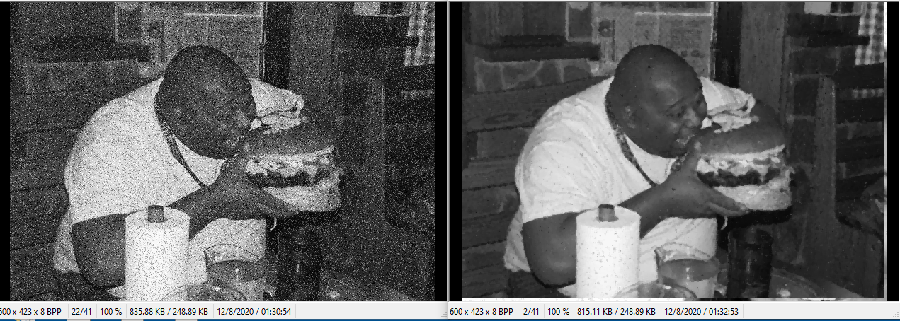
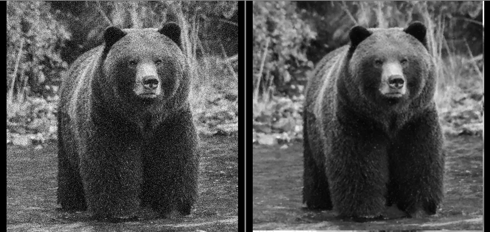
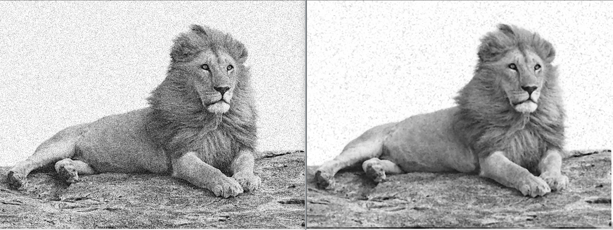
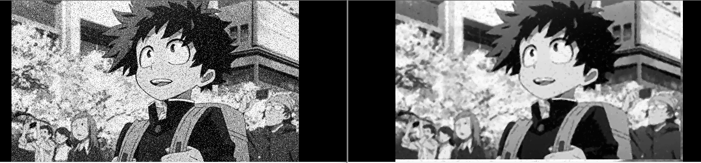
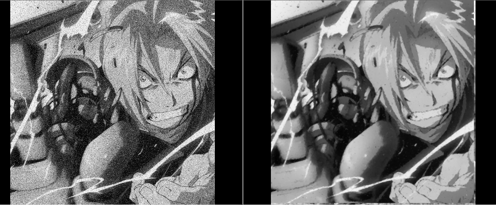
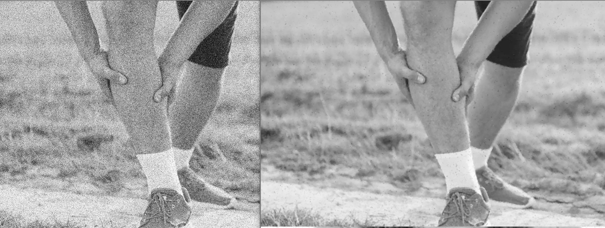
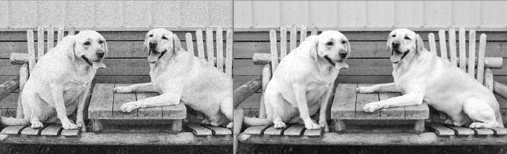
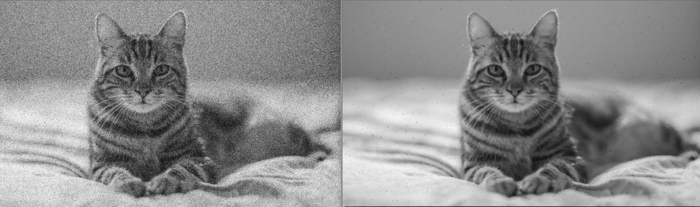

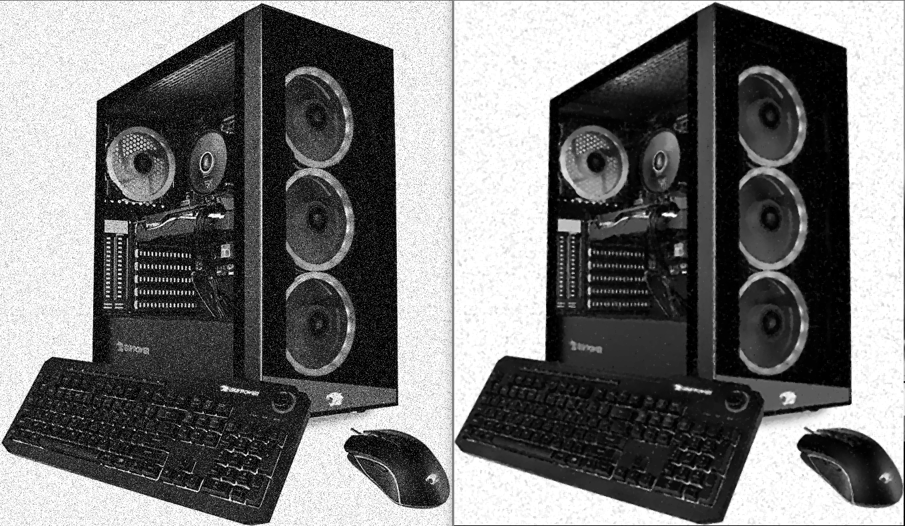
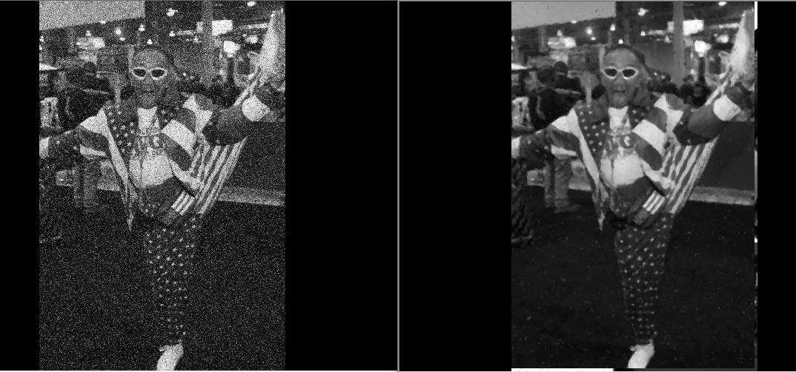

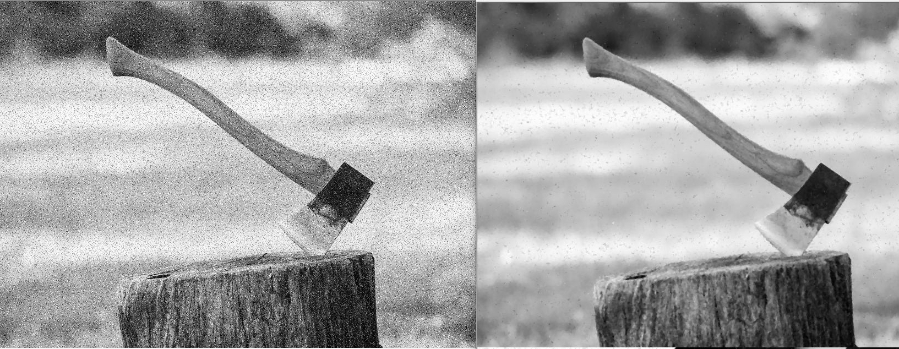
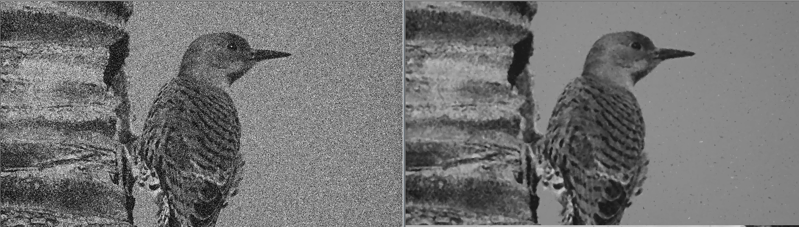

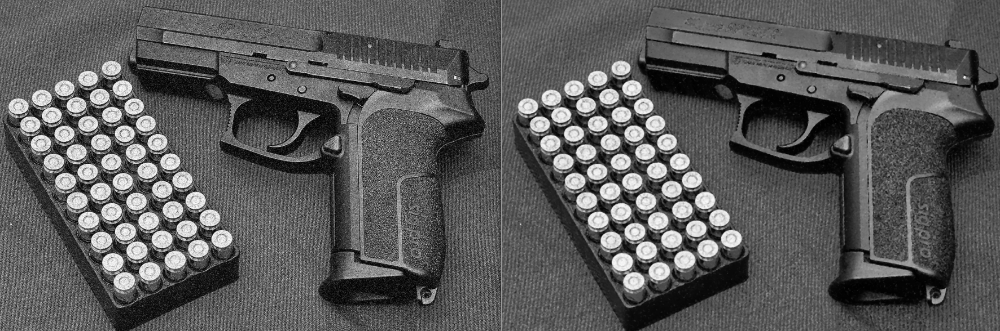
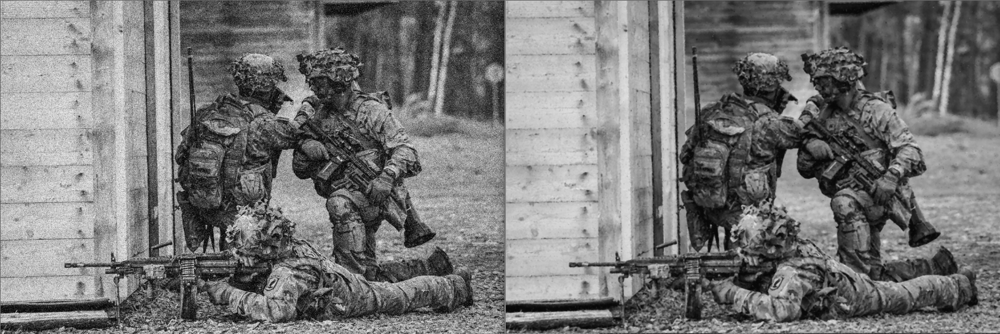
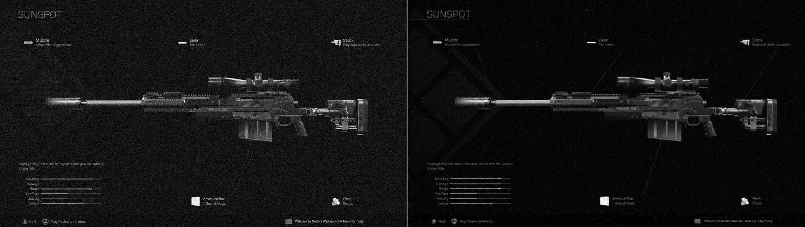

---
## Extra:
I was curious how using a different dimension size for a window would affect the output for median filtering.
I took the first image again and this time ran it through median filtering using a 10x10 window

### The resulting image has a lot less noise, but is far more blurrier in comparison!
---

